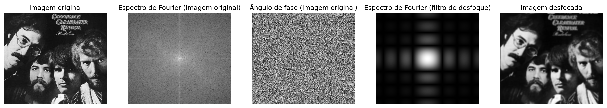

# Tratamento-de-imagens-com-fft

Este repositório contém os códigos utilizados como parte do Trabalho de Conclusão de Curso (TCC) de **Fernando Venâncio Aires Júnior** . O foco deste projeto é o uso da **Transformada de Fourier** no **processamento de imagens**.  

## Descrição do Projeto

A Transformada de Fourier é uma ferramenta matemática amplamente utilizada no processamento digital de sinais e imagens. Este trabalho explora aplicações como:
- Aplicação de desfoque  
- Filtragem de frequências em imagens.  
- Análise espectral de imagens.  
- Redução de ruídos.  

Os scripts fornecem exemplos práticos dessas aplicações, com implementações em Python.  

### Primeiro Tratamento de Imagem  

Uma das primeiras etapas do projeto foi aplicar a Transformada de Fourier para desfocar uma imagem.
Abaixo está o resultado:  



## Como Executar  

1. Certifique-se de ter Python 3.x instalado.

2. Crie  um ambiente virtual do python e instale as dependências:
    ```bash
    python3 -m venv myenv
    source myenv/bin/activate
    pip install numpy
    pip install opencv-python
    pip install matplotlib
    ```
2. Execute o script desejado:
   ```bash
   pithon3 fft_blur.py
   ```